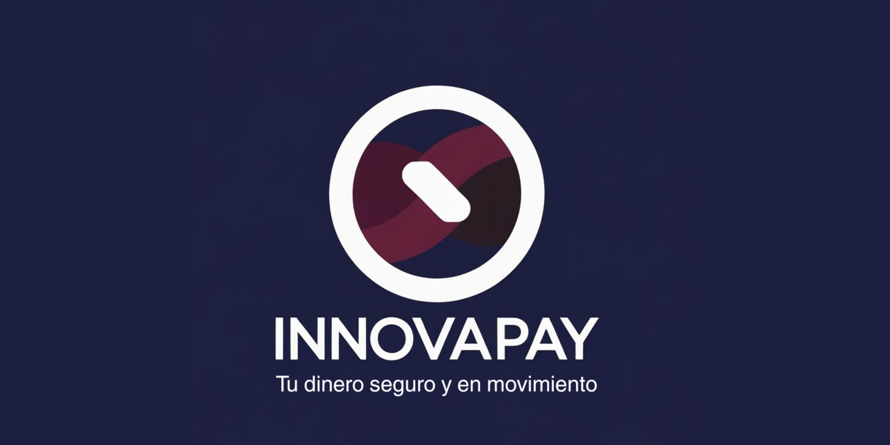
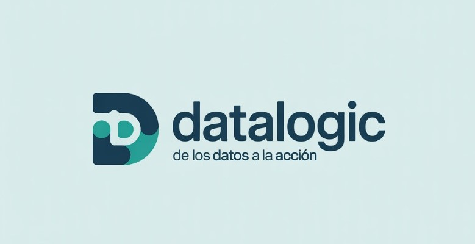

<h1 align= 'center'><strong>Predicción de Churn y Retención de Clientes para FinTech</strong></h1>

# Indice

- [Introduccion](#Introduccion)
- [Objetivos de Datalogic](#ObjetivosdeDatalogic)
- [Producto](#Producto)
- [Sobre Nosotros](#SobreNosotros)
- [Equipo](#Equipo)

# Introducción
## Problematica del negocio
InNovaPay opera en el sector FinTech, un entorno digital altamente competitivo donde la retención de clientes activos es un factor crítico para la sostenibilidad y el crecimiento. En este mercado dinámico, la pérdida de usuarios impacta directamente en la estabilidad de los ingresos y eleva los costos de adquisición. Actualmente, la identificación de clientes en riesgo de abandono es reactiva. Por ello, es imperativo implementar una solución que permita identificar de manera proactiva los patrones de comportamiento que conducen al abandono. 
  

    
  

Nuestro objetivo para la empresa es transformar esta gestión de riesgo, trabajando en conjunto con los diferentes profesionales que integran el equipo de Datalogic, para desarrollar un modelo de predicción robusto y generando insights accionables para diseñar y ejecutar campañas de retención oportunas y altamente rentables, dado que se informa que las instituciones que implementan IA para la optimización de procesos obtienen un retorno de inversión de 3.5× en 18 meses.

# Objetivos de Datalogic

* Desarrollar un modelo de predicción que:

- Identifique clientes con alto - riesgo de abandono.
- Ofrezca *insights* accionables para la retención.

* Creacion de un panel que permita a los equipos de marketing personalizar ofertas y campañas para retener a estos clientes.

Sera necesario también contar con:
* Dataset consolidado de comportamiento de clientes, con variables relevantes.
* Modelos de machine learning para clasificación y scoring de churn.
* API que permita consultar la probabilidad de abandono en tiempo real.
* Dashboards con segmentos de riesgo y recomendaciones de acciones.

# Producto

* [Informe EDA]()
* [Dasboard](https://lookerstudio.google.com/reporting/3a55f164-2eb4-4b21-983b-08cdffef6786)
* [Notebook Modelo]
* [App Web]

# Sobre Nosotros

  

    
  

Somos una consultora especializada en la implementación de soluciones de Inteligencia Artificial y Data Science con enfoque especializado para el sector FinTech.
Nuestro equipo multidisciplinario está diseñado para cubrir todo el pipeline del proyecto, desde la ingesta de datos hasta el despliegue del modelo y la generación de insights de negocio.
Nuestro Compromiso es llevar a nuestros clientes más allá de la simple predicción, entregando un sistema integral que:

- Garantice la integridad de los datos.
- Traduzca la predicción en valor monetario.
- Provea la mayor capacidad predictiva con transparencia.
  
# Equipo

  <table align= 'center'>
    <tr align= 'center'>
      <td align= 'center'>
         <strong>Marco</strong> 
        
        
      </td>
      <td align= 'center'>
         <strong>Michelle</strong> 
        
        
      </td>
      <td align= 'center'>
         <strong>Ludmila</strong> 
        
        
      </td>
    </tr>
  </table>

